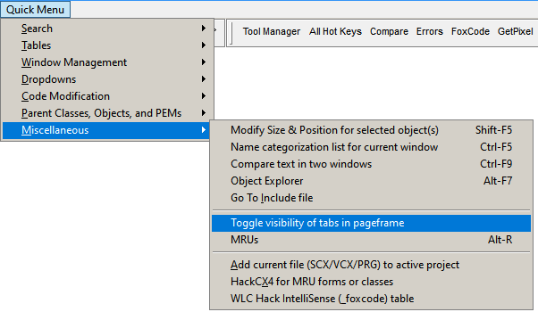

### Tool: Toggle PageFrame Tabs

#### Purpose:
This tool is used to navigate between pages of a pageframe where the tabs are not visible by toggling the value of the Tabs property so that they are temporarily visible.

#### Usage: 

1. Click on the pageframe *or any control on any page in the pageframe*. 
2. Use this tool; the tabs on the containing pageframe are toggled.

As simple as this is, the trick is to remember to re-set the Tabs setting back to its original value.  Thus, it's best practice to use this tool a second time as soon thereafter as reasonable.

#### Quick Menu access: 

![]

Last changed: _2023/04/30_ 

