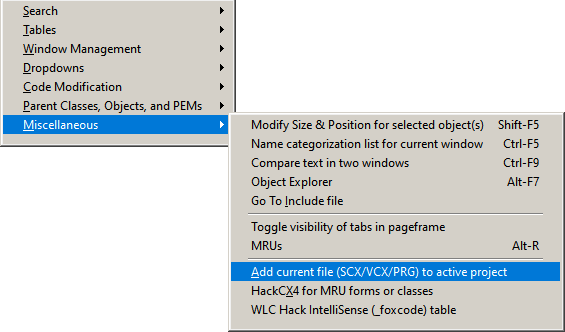

### Tool: Add To Project

#### Purpose:
Prompts whether to add to the active project the SCX / VCX / PRG corresponding to the current window having focus.

The full name of this tool should be "Add To / Remove From Project", since you will be prompted to remove the file if it is already in the project.

#### Quick Menu access: 

Last changed: _2023/05/01_ 

