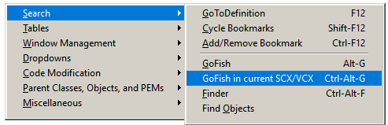

### Tool: GoFish / this SCX or VCX

#### Purpose:

Invokes GF to search for the currently highlighted text in only the current SCX or VCX.  This can be effective as it is much faster to search only one file and also obviates the need for filtering afterward.

#### Usage:
1. (optional) -- highlight text to be searched for.
1. Call this tool (it opens GF for you)
2. Save and close the SCX / VCX you are editing (GF cannot search it if it's open.)
3. Run GF
4. Call this tool again (restores GF to its prior state)

#### Quick Menu access: 

Last changed: _2023/05/01_ 

