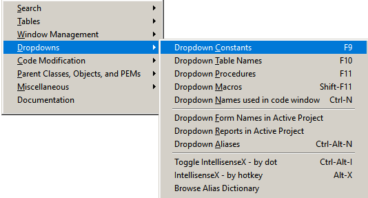
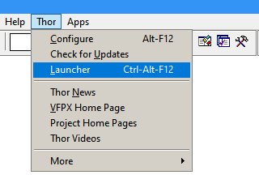
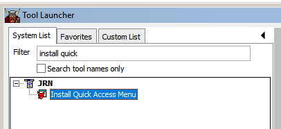

### Thor Quick Access Menu

The Thor Quick Access Menu, installed by Thor tool "Install Quick Access Menu", provides easy access to a host of the most commonly used Thor tools, all accessible from one place.

The Quick Access Menu is accessed from either the system menu pad (see below) or from a user-assigned hot key.

To install the Quick Access menu, run the Thor Launcher:

Enter "Install Quick" in the filter box, and then double-click on "Install Quick Access Menu"

Doing so will:
* Create the "Quick Access" menu pad
* Assign a hot key so that the same menu can be accessed as a pop-up, if desired.
* Assign hot keys to the most common tools.  This will NOT change any existing hot key assignments - tools already having hot keys will not be changed and no hot key in use will be re-assigned.

A backup of the Thor tables involved is created beforehand in case there is some need to restore to the previous state.

Installing this is a one-time event.  There are no plans for any updates, so the Quick Access menu can re-configured as desired by using the [Thor Configuration form](https://github.com/VFPX/Thor/blob/master/Docs/Thor_help.md) (Alt+F12).  You can:
* Change the name of the system menu pad (or remove it)
* Change the hot key used to access it
* Add, rename, or remove sub-menus
* Add, rename, or remove tools used in sub-menus
* Add, change, or remove hot keys assigned to sub-menus and tools

Last changed: _2023/05/16_ 

