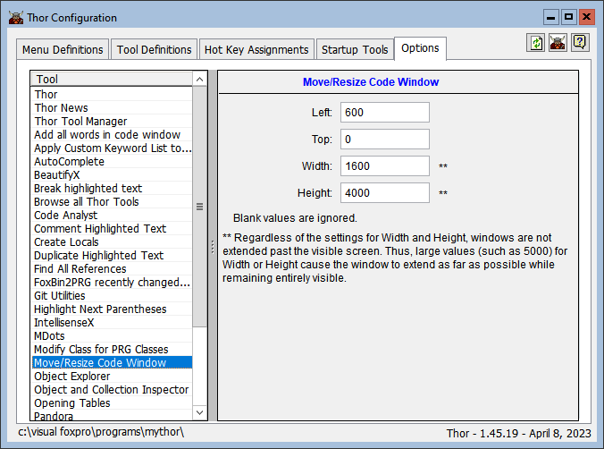

### Tool: Move & Resize current code window

Automatically moves and resizes the current edit window to a set size and position.

To specify the size and position to be used, use the "Options" page in the Thor Configuration form.

