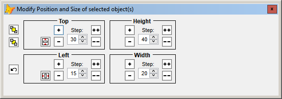
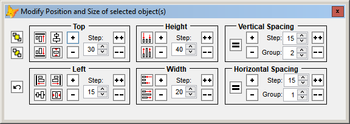
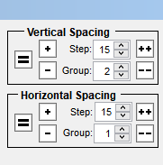

### Modify Position and Size of selected object(s)

The "Position and Size" form provides a handy way to modify the four position / size properties (Top / Left / Height / Width) for one or more selected objects.

#### Single Object selected

The less interesting case occurs when a single object is selected:

For each of the four properties, there is a container that allows you to change the properties:
* one pixel at a time ('+' or '-')
* by the step size ('++' or '--')

There are some buttons available as well (all of which have tooltips)
* (In the "Top" container) : Center vertically within the container
* (In the "Left" container) : Center horizontally within the container
* (On the left, top) : Bring to front
* (On the left, middle) : Send to back
* (On the left, bottom) : Undo.  You can undo any changes made by this form since it received focus. In other words, once you focus elsewhere, changes cannot be undone.

#### Multiple Objects selected

Of much more interest is what occurs when multiple objects are selected:

Each of the capabilities described above apply to all of the selected objects, as well as a number of new buttons:

In the "Top" container:
* Align top edges to the highest control
* Align bottom edges to the lowest control
* Align horizontal centers

In the "Left" container:
* Align left sides to the leftmost control
* Align right sides to the rightmost control
* Align vertical centers

In the "Height" container:
* Resize all to shortest control
* Resize all to tallest control

In the "Width" container:
* Resize all to narrowest control
* Resize all to widest control

#### Vertical and Horizontal Spacing

The controls on the far right are used to maintain either vertical or horizontal spacing between controls. 

(We'll describe how vertical spacing works.)

The selected controls are processed in order of their values of their Top properties, increasing/decreasing the distance between 
* one pixel at a time ('+' or '-')
* by the step size ('++' or '--')

This works well when increasing the distance between single controls, such as command buttons.

You can use the "Group" value to indicate that there are controls are in groups (such as a group of two for label / textbox pairs).  See this [demo video](https://www.youtube.com/watch?v=czQhb9W1ckA&t=73s) of how this works.

Finally, you can use the '=' buttons to have controls moved so that the distances between them (bottom of one with the top of the next) are identical. This works well when you selected controls includes some just added or removed (and are thus mis-aligned.)

### Notes
* The listbox is contained actually contained within a modal form. Thus, to remove the dropdown, you must press the Esc key.
* The listbox is resizable.  However its changed size does not persist to the next use.

Last changed: _2023/05/28_ 

